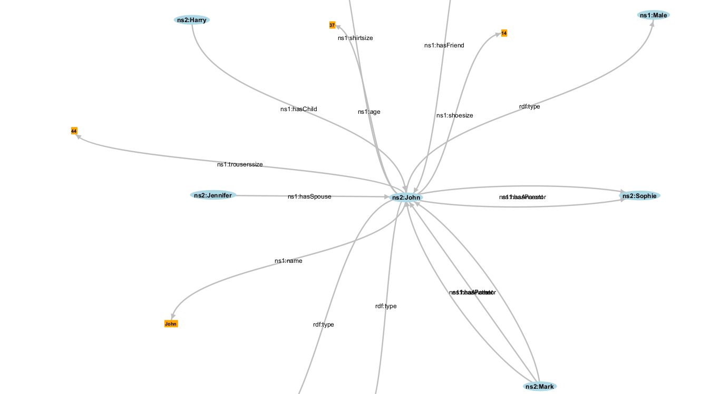

### Part I: The RDF Knowledge Base
#### 1. What is the namespace (prefix name and expanded URI) used for the individuals (or instances) in this knowledge base?
> The prefix name is "humans"
> 
> The expanded uri is "http://www.inria.fr/2007/09/11/humans.rdfs"
>

#### 2. What is the namespace (prefix name and expanded URI) used by the schema of this simple ontology?
> The prefix name is "xsd"
> 
> The expanded uri is "http://www.w3.org/2001/XMLSchema#"
>

#### 3. Write down all the information you know about John in the Turtle syntax.
```xml
@prefix humans: <http://www.inria.fr/2007/09/11/humans.rdfs> .

<http://www.w3.org/TR/rdf-syntax-grammar>
humans:John
  humans:name "John";
  humans:age: "37";
  humans:shoesize "14";
  humans:shirtsize "12";
  humans:trouserssize "44";
  humans:hasFriend humans:Alice;
  humans:hasParent humans:Harry;
  humans:hasParent humans:Sophie;
  humans:hasSpouse humans:Jennifer;
  humans:hasChild humans:Mark;
.
```
 
### Part II: SPARQL 101
#### 2. Write down in one sentence what this query means? Run this query, how many answers do you get? What is/are the type(s) of John?
> We are selecting all elements in the RDF (referenced by x) and we are also selecting the type for each one (referenced by t and)
>
> We get 69 answers
>
> John is referenced three times, and as such has three different types:
> http://www.inria.fr/2007/09/11/humans.rdfs#Person
> http://www.inria.fr/2007/09/11/humans.rdfs#Animal
> http://www.inria.fr/2007/09/11/humans.rdfs#Male
>
> Note that a Male is a Person and a Person in an Animal
>


#### 3. Write down in one sentence what this query means? Run this query, how many answers do you get?
> Selects all attributes from instances that have the relationship humans:hasSpouse
>
> We get 6 rows


#### 4. Look at the knowledge base and write down which RDF property is used for indicating the shoe size of the people?
> The property is "shoesize"

#### 5. Write down the SPARQL query that provides for all the people their shoe size? How many answers do you get?
```sql
PREFIX humans: <http://www.inria.fr/2007/09/11/humans.rdfs>
SELECT ?x ?y
WHERE
{
    ?x humans:shoesize ?y
}
```
> We get 7 results:

| num | ?x                                                           | ?y  |
| --- | ------------------------------------------------------------ | --- |
| 1   | http://www.inria.fr/2007/09/11/humans.rdfs-instances#John    | 14  |
| 2   | http://www.inria.fr/2007/09/11/humans.rdfs-instances#Mark    | 8   |
| 3   | http://www.inria.fr/2007/09/11/humans.rdfs-instances#Gaston  | 11  |
| 4   | http://www.inria.fr/2007/09/11/humans.rdfs-instances#Pierre  | 8   |
| 5   | http://www.inria.fr/2007/09/11/humans.rdfs-instances#Lucas   | 7   |
| 6   | http://www.inria.fr/2007/09/11/humans.rdfs-instances#William | 10  |
| 7   | http://www.inria.fr/2007/09/11/humans.rdfs-instances#Karl    | 7   |

#### 7. Write down the SPARQL query that provides for all the people their shoe size if this information is available? How many answers do you get?
```sql
PREFIX humans: <http://www.inria.fr/2007/09/11/humans.rdfs>
SELECT ?x ?y
WHERE
{
    ?x rdf:type humans:Person .
    OPTIONAL { ?x humans:shoesize ?y }
}
```

> We get 17 answers:
>

| num | ?x                                                             | ?y  |
| --- | -------------------------------------------------------------- | --- |
| 1   | http://www.inria.fr/2007/09/11/humans.rdfs-instances#Harry     |
| 2   | http://www.inria.fr/2007/09/11/humans.rdfs-instances#John      | 14  |
| 3   | http://www.inria.fr/2007/09/11/humans.rdfs-instances#Sophie    |
| 4   | http://www.inria.fr/2007/09/11/humans.rdfs-instances#Mark      | 8   |
| 5   | http://www.inria.fr/2007/09/11/humans.rdfs-instances#Eve       |
| 6   | http://www.inria.fr/2007/09/11/humans.rdfs-instances#David     |
| 7   | http://www.inria.fr/2007/09/11/humans.rdfs-instances#Alice     |
| 8   | http://www.inria.fr/2007/09/11/humans.rdfs-instances#Gaston    | 11  |
| 9   | http://www.inria.fr/2007/09/11/humans.rdfs-instances#Jack      |
| 10  | http://www.inria.fr/2007/09/11/humans.rdfs-instances#Flora     |
| 11  | http://www.inria.fr/2007/09/11/humans.rdfs-instances#Pierre    | 8   |
| 12  | http://www.inria.fr/2007/09/11/humans.rdfs-instances#Laura     |
| 13  | http://www.inria.fr/2007/09/11/humans.rdfs-instances#Jennifer  |
| 14  | http://www.inria.fr/2007/09/11/humans.rdfs-instances#Lucas     | 7   |
| 15  | http://www.inria.fr/2007/09/11/humans.rdfs-instances#Catherine |
| 16  | http://www.inria.fr/2007/09/11/humans.rdfs-instances#William   | 10  |
| 17  | http://www.inria.fr/2007/09/11/humans.rdfs-instances#Karl      | 7   |


#### 7. Write down the SPARQL query that provides the people who have a shoe size greater than 8? You can use the xsd:integer function to cast a variable into an integer (i.e. xsd:integer(?var)).
```sql
PREFIX humans: <http://www.inria.fr/2007/09/11/humans.rdfs>
SELECT ?x ?y
WHERE
{
    ?x humans:shoesize ?y
    FILTER ( xsd:integer(?y) > 8 )
}
```

| num | ?x                                                           | ?y  |
| --- | ------------------------------------------------------------ | --- |
| 1   | http://www.inria.fr/2007/09/11/humans.rdfs-instances#John    | 14  | 14 |
| 2   | http://www.inria.fr/2007/09/11/humans.rdfs-instances#Gaston  | 11  | 11 |
| 3   | http://www.inria.fr/2007/09/11/humans.rdfs-instances#William | 10  | 10 |


#### 8. Write down the SPARQL query that provides the people who have a shoe size greater than 8 or who have the shirt size greater than 12?
```sql
PREFIX humans: <http://www.inria.fr/2007/09/11/humans.rdfs>
SELECT ?x ?y ?z
WHERE
{
    OPTIONAL { ?x humans:shoesize ?y }
    OPTIONAL { ?x humans:shirtsize ?z }
    FILTER ( xsd:integer(?y) > 8 || xsd:integer(?z) > 12)
}
```

| num | ?x                                                           | ?y  |
| --- | ------------------------------------------------------------ | --- |
| 1   | http://www.inria.fr/2007/09/11/humans.rdfs-instances#John    | 14  | 12 |
| 2   | http://www.inria.fr/2007/09/11/humans.rdfs-instances#Gaston  | 11  | 12 |
| 3   | http://www.inria.fr/2007/09/11/humans.rdfs-instances#William | 10  | 13 |

#### 9. Look up the URI that identifies John and ask the engine what is the description of this person using the appropriate SPARQL keyword (see slide 50)?
> The URI that identifies John is http://www.inria.fr/2007/09/11/humans.rdfs-instances#John
> We can ask the engine with the following query:
>
```sql
DESCRIBE <http://www.inria.fr/2007/09/11/humans.rdfs-instances#John>
```
> And the resulting graph:
>


#### 10. Write down the SPARQL query that provides the people that have at least one child? How many answers do you get? How many duplicates can you identify? Write down another SPARQL query that will remove the duplicates?
```sql

```
